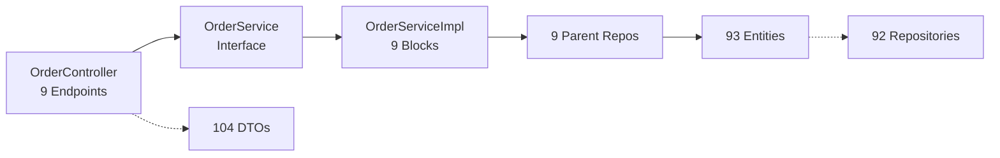

# Orders API — Repository Context Index

> [!NOTE]
> **Project**: PayPal-style Orders API built with **Spring Boot 4.0.3**, **Java 17**, **MySQL**, **Lombok**, and **Spring Data JPA**.
> Runs on **port 8082** with `ddl-auto=create`.

---

## 📁 Project Structure

```
com.example.Orders
├── Controller/           # 1 REST controller
├── DTO/
│   ├── leafDTOs/         # 42 leaf-level DTOs
│   ├── parentDTOs/       # 10 parent request DTOs (includes 1 response DTO used as parent)
│   ├── responseDTOs/     # 8 response DTOs
│   ├── subparentDTOs/    # 14 sub-parent DTOs
│   └── subchildDTOs/     # 30 sub-child DTOs
├── Entity/
│   ├── leaf/             # 41 leaf entities
│   ├── parent/           # 9 parent entities
│   ├── subparent/        # 14 sub-parent entities
│   └── subchild/         # 29 sub-child entities
├── Repository/
│   ├── leafRepository/   # 41 leaf repositories
│   ├── parentRepository/ # 9 parent repositories
│   ├── subparentRepository/  # 14 sub-parent repositories
│   └── subchildRepository/   # 29 sub-child repositories
├── Service/              # 1 service interface
├── ServiceImpl/          # 1 service implementation
└── OrdersApplication.java
```

---

## 🎮 Controller

### [OrderController.java](file:///c:/Users/asy02/Downloads/Internship%20Task%20v2/Orders/src/main/java/com/example/Orders/Controller/OrderController.java)
**Base path**: `/api/orders`

| # | Method | Endpoint | Request DTO | Response DTO | Status |
|---|--------|----------|-------------|--------------|--------|
| 1 | `POST` | `/createOrder` | [CreateOrderRequestDTO](file:///c:/Users/asy02/Downloads/Internship%20Task%20v2/Orders/src/main/java/com/example/Orders/DTO/parentDTOs/CreateOrderRequestDTO.java#12-29) | [CreateOrderResponseDTO](file:///c:/Users/asy02/Downloads/Internship%20Task%20v2/Orders/src/main/java/com/example/Orders/DTO/responseDTOs/CreateOrderResponseDTO.java#15-47) | `201 CREATED` |
| 2 | `GET` | `/showOrderDetails` | *(query params)* | `OrderDetailsResponseDTO` | `200 OK` |
| 3 | `PATCH` | `/updateOrder` | `UpdateOrderRequestDTO` | `UpdateOrderResponseDTO` | `200 OK` |
| 4 | `POST` | `/confirmOrder` | `ConfirmOrderRequestDTO` | `ConfirmOrderResponseDTO` | `200 OK` |
| 5 | `POST` | `/authorizeOrder` | `AuthorizeOrderRequestDTO` | `AuthorizeOrderResponseDTO` | `200 OK` |
| 6 | `POST` | `/captureOrder` | `CaptureOrderRequestDTO` | `CaptureOrderResponseDTO` | `200 OK` |
| 7 | `POST` | `/addTracking` | `AddTrackingRequestDTO` | `AddTrackingResponseDTO` | `201 CREATED` |
| 8 | `PATCH` | `/updateTracking` | `UpdateTrackingRequestDTO` | `UpdateTrackingResponseDTO` | `200 OK` |
| 9 | `POST` | `/updateOrderCallback` | `UpdateOrderCallbackRequestDTO` | `UpdateOrderCallbackResponseDTO` | `200 OK` |

---

## 🗄️ Entities (93 total)

### Parent Entities (9) — `Entity.parent`

| Entity Class | Table | Primary Key | Relationships |
|---|---|---|---|
| [CreateOrder](file:///c:/Users/asy02/Downloads/Internship%20Task%20v2/Orders/src/main/java/com/example/Orders/Entity/parent/CreateOrder.java#24-54) | `create_order_event` | `UUID createOrderId` | `@OneToOne Payer`, `@OneToMany PurchaseUnit`, `@OneToOne ApplicationContext` |
| `ShowOrderDetails` | *(default)* | auto-generated | — |
| `UpdateOrder` | *(default)* | auto-generated | — |
| `ConfirmOrder` | *(default)* | auto-generated | `@OneToOne ApplicationContext`, `@OneToOne PaymentSource` |
| `AuthorizePaymentForOrder` | *(default)* | auto-generated | — |
| `CapturePaymentForOrder` | *(default)* | auto-generated | — |
| `AddTrackingInformationForAnOrder` | *(default)* | auto-generated | — |
| `UpdateOrderTracker` | *(default)* | auto-generated | — |
| `OrderUpdateCallback` | *(default)* | auto-generated | — |

### Sub-Parent Entities (14) — `Entity.subparent`

| Entity | Description |
|---|---|
| [Payer](file:///c:/Users/asy02/Downloads/Internship%20Task%20v2/Orders/src/main/java/com/example/Orders/Entity/subparent/Payer.java#23-64) | Email, payerId, birthDate; has `@OneToOne` to `Name`, `phone`, `tax_info`, [address](file:///c:/Users/asy02/Downloads/Internship%20Task%20v2/Orders/src/main/java/com/example/Orders/Entity/leaf/address.java#14-42) |
| [PaymentSource](file:///c:/Users/asy02/Downloads/Internship%20Task%20v2/Orders/src/main/java/com/example/Orders/ServiceImpl/OrderServiceImpl.java#248-272) | Has `@OneToOne Card` |
| [PurchaseUnit](file:///c:/Users/asy02/Downloads/Internship%20Task%20v2/Orders/src/main/java/com/example/Orders/ServiceImpl/OrderServiceImpl.java#201-230) | referenceId, description, customId, invoiceId, softDescriptor |
| [ApplicationContext](file:///c:/Users/asy02/Downloads/Internship%20Task%20v2/Orders/src/main/java/com/example/Orders/ServiceImpl/OrderServiceImpl.java#231-247) | brandName, landingPage, shippingPreference, userAction, returnUrl, cancelUrl, locale |
| `AddTracking` | — |
| `AuthorizeOrder` | — |
| `CaptureOrder` | — |
| `Items` | — |
| `Links` | — |
| `OrderErrorEvent` | — |
| `PurchaseUnitAmount` | — |
| [PurchaseUnits](file:///c:/Users/asy02/Downloads/Internship%20Task%20v2/Orders/src/main/java/com/example/Orders/ServiceImpl/OrderServiceImpl.java#201-230) | — |
| `SupplementaryData` | — |
| `UpdateOrderCallback` | — |

### Sub-Child Entities (29) — `Entity.subchild`

| Entity |
|---|
| `AmountBreakdown`, `ApplePay`, `Bancontact`, `BillingCycle`, `Blik`, `Card`, `CardAttributes`, `CardCustomer`, `Eps`, `Giropay`, `GooglePay`, `Ideal`, `Item`, `Mybank`, `OrderUpdateCallbackConfig`, `P24`, `PaymentInstruction`, `Paypal`, `PaypalAttributes`, `PaypalCustomer`, `PlatformFee`, `PricingScheme`, `ShippingDetail`, `ShippingOption`, `Sofort`, `Trustly`, `Venmo`, `VenmoAttributes`, `VenmoCustomer` |

### Leaf Entities (41) — `Entity.leaf`

| Entity |
|---|
| [address](file:///c:/Users/asy02/Downloads/Internship%20Task%20v2/Orders/src/main/java/com/example/Orders/Entity/leaf/address.java#14-42), `amount`, `assurance_detail`, `billing_address`, `CallbackEvents`, `customer`, `decrypted_token`, `Discount`, `DiscountAmount`, `duty_amount`, `ErrorDetail`, `experience_context`, `Handling`, `Insurance`, `ItemTotal`, `Level0`, `Link`, `Mobile_Web`, `Name`, `NetworkToken`, `OneClick`, `payee`, `phone`, `PreviousNetworkTransactionReference`, `Price`, `ReloadThresholdAmount`, `SetupFee`, `Shipping`, `ShippingDiscount`, `Shipping_address`, `Shipping_amount`, `StoredCredential`, `Tax`, `TaxTotal`, `tax_amount`, `tax_info`, `TotalAmount`, `UnitAmount`, `Upc`, `Vault`, `Verification` |

---

## 📦 DTOs (104 total)

### Parent Request DTOs (10) — `DTO.parentDTOs`

| DTO | Used By Endpoint |
|---|---|
| [CreateOrderRequestDTO](file:///c:/Users/asy02/Downloads/Internship%20Task%20v2/Orders/src/main/java/com/example/Orders/DTO/parentDTOs/CreateOrderRequestDTO.java#12-29) | `POST /createOrder` |
| `OrderDetailsResponseDTO` | `GET /showOrderDetails` *(response used as parent DTO)* |
| `UpdateOrderRequestDTO` | `PATCH /updateOrder` |
| `ConfirmOrderRequestDTO` | `POST /confirmOrder` |
| `AuthorizeOrderRequestDTO` | `POST /authorizeOrder` |
| `CaptureOrderRequestDTO` | `POST /captureOrder` |
| `AddTrackingRequestDTO` | `POST /addTracking` |
| `UpdateTrackingRequestDTO` | `PATCH /updateTracking` |
| `UpdateOrderCallbackRequestDTO` | `POST /updateOrderCallback` |
| `ErrorResponseDTO` | Error handling |

### Response DTOs (8) — `DTO.responseDTOs`

| DTO | Used By Endpoint |
|---|---|
| [CreateOrderResponseDTO](file:///c:/Users/asy02/Downloads/Internship%20Task%20v2/Orders/src/main/java/com/example/Orders/DTO/responseDTOs/CreateOrderResponseDTO.java#15-47) | `POST /createOrder` |
| `ConfirmOrderResponseDTO` | `POST /confirmOrder` |
| `AuthorizeOrderResponseDTO` | `POST /authorizeOrder` |
| `CaptureOrderResponseDTO` | `POST /captureOrder` |
| `AddTrackingResponseDTO` | `POST /addTracking` |
| `UpdateOrderResponseDTO` | `PATCH /updateOrder` |
| `UpdateTrackingResponseDTO` | `PATCH /updateTracking` |
| `UpdateOrderCallbackResponseDTO` | `POST /updateOrderCallback` |

### Sub-Parent DTOs (14) — `DTO.subparentDTOs`

| DTO |
|---|
| `PayerDTO`, `PaymentSourceDTO`, `PurchaseUnitDTO`, `ApplicationContextDTO`, `AddTrackingDTO`, `AuthorizeOrderDTO`, `CaptureOrderDTO`, `ItemsDTO`, `LinksDTO`, `OrderErrorEventDTO`, `PurchaseUnitAmountDTO`, `PurchaseUnitsDTO`, `SupplementaryDataDTO`, `UpdateOrderCallbackDTO` |

### Sub-Child DTOs (30) — `DTO.subchildDTOs`

| DTO |
|---|
| `AmountBreakdownDTO`, `ApplePayDTO`, `BancontactDTO`, `BillingCycleDTO`, `BlikDTO`, `CardDTO`, `CardAttributesDTO`, `CardCustomerDTO`, `EpsDTO`, `ErrorDetailsDTO`, `GiropayDTO`, `GooglePayDTO`, `IdealDTO`, `ItemDTO`, `MybankDTO`, `OrderUpdateCallbackConfigDTO`, `P24DTO`, `PaymentInstructionDTO`, `PaypalDTO`, `PaypalAttributesDTO`, `PaypalCustomerDTO`, `PlatformFeeDTO`, `PricingSchemeDTO`, `ShippingDetailDTO`, `ShippingOptionDTO`, `SofortDTO`, `TrustlyDTO`, `VenmoDTO`, `VenmoAttributesDTO`, `VenmoCustomerDTO` |

### Leaf DTOs (42) — `DTO.leafDTOs`

| DTO |
|---|
| `AddressDTO`, `AmountDTO`, `AssuranceDetailDTO`, `BillingAddressDTO`, `CallbackEventsDTO`, `CustomerDTO`, `DecryptedTokenDTO`, `DiscountAmountDTO`, `DiscountDTO`, `DutyAmountDTO`, `ExperienceContextDTO`, `HandlingDTO`, `InsuranceDTO`, `ItemTotalDTO`, `Level0DTO`, `LinkDTO`, `MobileWebDTO`, `NameDTO`, `NetworkTokenDTO`, `OneClickDTO`, `PatchOperationDTO`, `PayeeDTO`, `PhoneDTO`, `PreviousNetworkTransactionReferenceDTO`, `PriceDTO`, `ReloadThresholdAmountDTO`, `SetupFeeDTO`, `ShippingAddressDTO`, `ShippingAmountDTO`, `ShippingDTO`, `ShippingDiscountDTO`, `StoredCredentialDTO`, `TaxAmountDTO`, `TaxDTO`, `TaxInfoDTO`, `TaxTotalDTO`, `TotalAmountDTO`, `UnitAmountDTO`, `UpcDTO`, `VaultDTO`, `VerificationDTO` |

---

## 🔌 Service Layer

### [OrderService.java](file:///c:/Users/asy02/Downloads/Internship%20Task%20v2/Orders/src/main/java/com/example/Orders/Service/OrderService.java) — Interface
Defines 9 endpoint methods matching the controller 1:1.

### [OrderServiceImpl.java](file:///c:/Users/asy02/Downloads/Internship%20Task%20v2/Orders/src/main/java/com/example/Orders/ServiceImpl/OrderServiceImpl.java) — Implementation

| Block | Method | Implementation Status |
|---|---|---|
| 1 | [createOrder()](file:///c:/Users/asy02/Downloads/Internship%20Task%20v2/Orders/src/main/java/com/example/Orders/ServiceImpl/OrderServiceImpl.java#98-150) | ✅ Full — maps [Payer](file:///c:/Users/asy02/Downloads/Internship%20Task%20v2/Orders/src/main/java/com/example/Orders/Entity/subparent/Payer.java#23-64), [PurchaseUnit](file:///c:/Users/asy02/Downloads/Internship%20Task%20v2/Orders/src/main/java/com/example/Orders/ServiceImpl/OrderServiceImpl.java#201-230), [ApplicationContext](file:///c:/Users/asy02/Downloads/Internship%20Task%20v2/Orders/src/main/java/com/example/Orders/ServiceImpl/OrderServiceImpl.java#231-247) with helpers |
| 2 | [showOrderDetails()](file:///c:/Users/asy02/Downloads/Internship%20Task%20v2/Orders/src/main/java/com/example/Orders/Service/OrderService.java#35-42) | ⚠️ Stub — saves empty entity, returns hardcoded `"READ"` status |
| 3 | [updateOrder()](file:///c:/Users/asy02/Downloads/Internship%20Task%20v2/Orders/src/main/java/com/example/Orders/Controller/OrderController.java#75-84) | ⚠️ Stub — no DTO-to-entity mapping |
| 4 | [confirmOrder()](file:///c:/Users/asy02/Downloads/Internship%20Task%20v2/Orders/src/main/java/com/example/Orders/Service/OrderService.java#51-60) | ✅ Partial — maps [ApplicationContext](file:///c:/Users/asy02/Downloads/Internship%20Task%20v2/Orders/src/main/java/com/example/Orders/ServiceImpl/OrderServiceImpl.java#231-247) and [PaymentSource](file:///c:/Users/asy02/Downloads/Internship%20Task%20v2/Orders/src/main/java/com/example/Orders/ServiceImpl/OrderServiceImpl.java#248-272) |
| 5 | [authorizeOrder()](file:///c:/Users/asy02/Downloads/Internship%20Task%20v2/Orders/src/main/java/com/example/Orders/ServiceImpl/OrderServiceImpl.java#359-380) | ⚠️ Stub — no entity mapping |
| 6 | [captureOrder()](file:///c:/Users/asy02/Downloads/Internship%20Task%20v2/Orders/src/main/java/com/example/Orders/Controller/OrderController.java#110-122) | ⚠️ Stub — no entity mapping |
| 7 | [addTracking()](file:///c:/Users/asy02/Downloads/Internship%20Task%20v2/Orders/src/main/java/com/example/Orders/Service/OrderService.java#83-90) | ⚠️ Stub — no entity mapping |
| 8 | [updateTracking()](file:///c:/Users/asy02/Downloads/Internship%20Task%20v2/Orders/src/main/java/com/example/Orders/Controller/OrderController.java#133-143) | ⚠️ Stub — no entity mapping |
| 9 | [updateOrderCallback()](file:///c:/Users/asy02/Downloads/Internship%20Task%20v2/Orders/src/main/java/com/example/Orders/Controller/OrderController.java#144-151) | ⚠️ Stub — no entity mapping |

**Helper methods**: [mapPayer()](file:///c:/Users/asy02/Downloads/Internship%20Task%20v2/Orders/src/main/java/com/example/Orders/ServiceImpl/OrderServiceImpl.java#153-200), [mapPurchaseUnits()](file:///c:/Users/asy02/Downloads/Internship%20Task%20v2/Orders/src/main/java/com/example/Orders/ServiceImpl/OrderServiceImpl.java#201-230), [mapApplicationContext()](file:///c:/Users/asy02/Downloads/Internship%20Task%20v2/Orders/src/main/java/com/example/Orders/ServiceImpl/OrderServiceImpl.java#231-247), [mapPaymentSource()](file:///c:/Users/asy02/Downloads/Internship%20Task%20v2/Orders/src/main/java/com/example/Orders/ServiceImpl/OrderServiceImpl.java#248-272)

---

## 🗃️ Repositories (92 total)

All repositories follow the `JpaRepository<Entity, UUID>` pattern.

| Category | Count | Package |
|---|---|---|
| Parent Repositories | 9 | `Repository.parentRepository` |
| Sub-Parent Repositories | 14 | `Repository.subparentRepository` |
| Sub-Child Repositories | 29 | `Repository.subchildRepository` |
| Leaf Repositories | 41 | `Repository.leafRepository` |

> [!IMPORTANT]
> **Only 9 parent repositories** are injected into [OrderServiceImpl](file:///c:/Users/asy02/Downloads/Internship%20Task%20v2/Orders/src/main/java/com/example/Orders/ServiceImpl/OrderServiceImpl.java#59-482). The sub-parent, sub-child, and leaf repositories exist but are **not directly used** — entities cascade via `CascadeType.ALL`.

---

## 🧪 Test Data — `NEW_MASTER_JSON/`

| File | Maps To Endpoint |
|---|---|
| [POST_create_order.json](file:///c:/Users/asy02/Downloads/Internship%20Task%20v2/Orders/NEW_MASTER_JSON/POST_create_order.json) | `POST /api/orders/createOrder` |
| [GET_200_show_order_details.json](file:///c:/Users/asy02/Downloads/Internship%20Task%20v2/Orders/NEW_MASTER_JSON/GET_200_show_order_details.json) | `GET /api/orders/showOrderDetails` |
| [GET_404_show_order_details.json](file:///c:/Users/asy02/Downloads/Internship%20Task%20v2/Orders/NEW_MASTER_JSON/GET_404_show_order_details.json) | `GET /api/orders/showOrderDetails` (error case) |
| [POST_confirm_order.json](file:///c:/Users/asy02/Downloads/Internship%20Task%20v2/Orders/NEW_MASTER_JSON/POST_confirm_order.json) | `POST /api/orders/confirmOrder` |
| [POST_authorize_payment_for_order.json](file:///c:/Users/asy02/Downloads/Internship%20Task%20v2/Orders/NEW_MASTER_JSON/POST_authorize_payment_for_order.json) | `POST /api/orders/authorizeOrder` |
| [POST_capture_payment_for_order.json](file:///c:/Users/asy02/Downloads/Internship%20Task%20v2/Orders/NEW_MASTER_JSON/POST_capture_payment_for_order.json) | `POST /api/orders/captureOrder` |
| [POST_add_tracking_information_for_an_order.json](file:///c:/Users/asy02/Downloads/Internship%20Task%20v2/Orders/NEW_MASTER_JSON/POST_add_tracking_information_for_an_order.json) | `POST /api/orders/addTracking` |
| [POST_order_update_callback.json](file:///c:/Users/asy02/Downloads/Internship%20Task%20v2/Orders/NEW_MASTER_JSON/POST_order_update_callback.json) | `POST /api/orders/updateOrderCallback` |

> [!WARNING]
> Missing test JSON for: `PATCH /updateOrder` and `PATCH /updateTracking`.

---

## ⚙️ Configuration

| Property | Value |
|---|---|
| `server.port` | `8082` |
| `spring.datasource.url` | `jdbc:mysql://localhost:3306/Orders` |
| `spring.datasource.username` | `root` |
| `spring.datasource.password` | `root` |
| `spring.jpa.hibernate.ddl-auto` | [create](file:///c:/Users/asy02/Downloads/Internship%20Task%20v2/Orders/src/main/java/com/example/Orders/ServiceImpl/OrderServiceImpl.java#98-150) |
| `server.error.include-message` | `always` |
| `server.error.include-stacktrace` | `always` |

---

## 📊 Summary Statistics



| Component | Count |
|---|---|
| Controllers | **1** |
| Endpoints | **9** |
| Service Interfaces | **1** |
| Service Implementations | **1** |
| Entities | **93** (9 parent + 14 subparent + 29 subchild + 41 leaf) |
| DTOs | **104** (10 parent + 8 response + 14 subparent + 30 subchild + 42 leaf) |
| Repositories | **92** (9 parent + 14 subparent + 29 subchild + 41 leaf) |
| Test JSON files | **8** |
